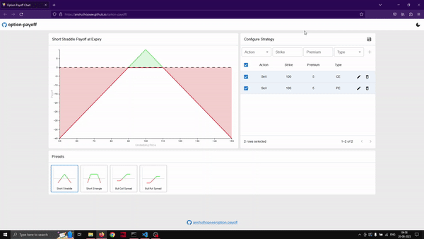

An Option Payoff visualizing tool, that allows you to create strategies, add and modify option legs, visualize their payoffs as it would be on the expiry date and save them to local storage. The site takes, "Buy/Sell", "Strike Price", "Premium", and "PE/CE" (Put/Call) as inputs to plot the payoff. In the future, "Days to Expiry" input, will be added to make the payoff more comprehensive and allow strategies like "Calendar Spreads" to be visualized.

## Demo

## Presets
1. Short Straddle.
2. Short Strangle.
3. Bull Call Spread.
4. Bull Put Spread.

## Features
1. Edit/Delete option legs with their respective buttons.
2. Select/Unselect option legs with the checkbox.
3. Save modified (custom) strategies as new, or update existing modified (custom) strategies.
4. Persistence of saved strategies through local storage.

## To be added
1. Lines inidcating break-even point(s).
2. Tooltips.
3. Zoom functionality for chart.

## Site link
## https://anshuthopsee.github.io/option-payoff/